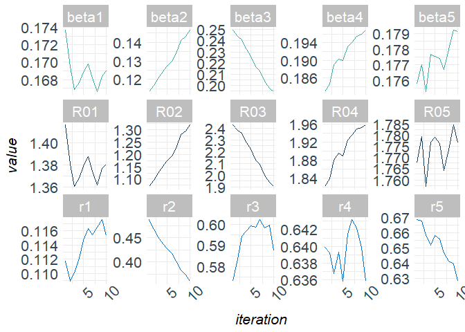
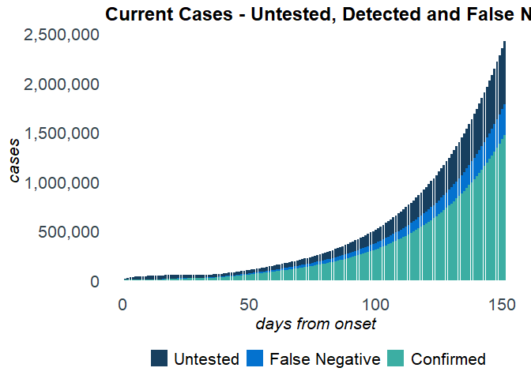

<!-- README.md is generated from README.Rmd. Please edit that file -->

# R package `SEIRfansy`

# Extended Susceptible-Exposed-Infected-Recovery Model

[](https://github.com/umich-biostatistics/SIERfansy)
[](https://github.com/umich-biostatistics/SEIRfansy)

## Overview

This `R` package fits Extended Susceptible-Exposed-Infected-Recovery
(SEIR) Models for handling high false negative rate and symptom based
administration of diagnostic tests.

## Installation

If the devtools package is not yet installed, install it first:

``` r
install.packages('devtools')
```

``` r
# install SEIRfansy from Github:
devtools::install_github('umich-biostatistics/SEIRfansy') 
```

Once installed, load the package:

``` r
library(SEIRfansy)
#> Registered S3 methods overwritten by 'car':
#>   method                          from
#>   influence.merMod                lme4
#>   cooks.distance.influence.merMod lme4
#>   dfbeta.influence.merMod         lme4
#>   dfbetas.influence.merMod        lme4
```

## Example Usage

For this example, we use the built-in package data set `covid19`, which
contains dailies and totals of cases, recoveries, and deaths from the
COVID-19 outbreak in India from January 30 to September 21 of 2020.

### Setup

You will need the `dplyr` package for this example.

``` r
library(dplyr)
#> 
#> Attaching package: 'dplyr'
#> The following objects are masked from 'package:stats':
#> 
#>     filter, lag
#> The following objects are masked from 'package:base':
#> 
#>     intersect, setdiff, setequal, union
```

Training data set:

For training data, we use cases from April 1 to June 30

``` r
train = covid19[which(covid19$Date == "01 April "):which(covid19$Date == "30 June "),]
```

Testing data set:

For testing data, we use cases from July 1 to July 31

``` r
test = covid19[which(covid19$Date == "01 July "):which(covid19$Date == "31 July "),]
```

Data format for multinomial and Poisson distribution:

``` r
train_multinom = 
  train %>% 
  rename(Confirmed = Daily.Confirmed, 
         Recovered = Daily.Recovered,
         Deceased = Daily.Deceased) %>%
  dplyr::select(Confirmed, Recovered, Deceased)

test_multinom = 
  test %>% 
  rename(Confirmed = Daily.Confirmed, 
         Recovered = Daily.Recovered,
         Deceased = Daily.Deceased) %>%
  dplyr::select(Confirmed, Recovered, Deceased)

train_pois = 
  train %>% 
  rename(Confirmed = Daily.Confirmed) %>%
  dplyr::select(Confirmed)
```

Initialize parameters:

``` r
N = 1341e6 # population size of India
data_initial = c(2059, 169, 58, 424, 9, 11)
pars_start = c(c(1,0.8,0.6,0.4,0.2), c(0.2,0.2,0.2,0.25,0.2))
phases = c(1,15,34,48,62)
```

## SEIRfansy()

If interest is in model estimation but not prediction, then use
`SEIRfansy()`. Otherwise, use `SEIRfansy.predict()` (see below).

``` r
?SEIRfansy
```

``` r
cov19est = SEIRfansy(data = train_multinom, init_pars = pars_start, 
                     data_init = data_initial, niter = 1e3, BurnIn = 1e2, 
                     model = "Multinomial", N = N, lambda = 1/(69.416 * 365), 
                     mu = 1/(69.416 * 365), period_start = phases, opt_num = 1, 
                     auto.initialize = TRUE, f = 0.15)
#> Finding MLE
#> 1 MLE run finished!
#>  
#> MLE estimates : 
#> beta = ( 0.18, 0.1, 0.25, 0.18, 0.18 )
#> r = ( 0.112, 0.531, 0.544, 0.65, 0.688 )
#>  
#> MCMC:
#> Iter 100  A = 0  :  0.1758 0.1076 0.2543 0.1795 0.176 0.1121 0.5176 0.5528 
#> 0.6627 0.6858
#> Iter 200  A = 0  :  0.1724 0.1125 0.2517 0.1792 0.1751 0.1121 0.4846 0.5725 
#> 0.6659 0.6857
#> Iter 300  A = 0.0385  :  0.1691 0.1175 0.2433 0.1818 0.1757 0.1109 0.471 0.5749 
#> 0.6662 0.68
#> Iter 400  A = 2142.403  :  0.1688 0.1213 0.2355 0.1828 0.1745 0.1124 0.4533 
#> 0.5913 0.6569 0.6954
#> Iter 500  A = 0  :  0.1663 0.1254 0.2282 0.1841 0.175 0.1165 0.4421 0.5991 
#> 0.6576 0.6976
#> Iter 600  A = 2.571505e+12  :  0.1663 0.1302 0.2213 0.185 0.177 0.1162 0.4198 
#> 0.5911 0.6611 0.6804
#> Iter 700  A = 0  :  0.1688 0.1332 0.2152 0.1857 0.1762 0.1166 0.405 0.5962 
#> 0.6574 0.6765
#> Iter 800  A = 1.2097  :  0.168 0.1401 0.2078 0.1864 0.1782 0.1164 0.3898 0.5818 
#> 0.6555 0.662
#> Iter 900  A = 0  :  0.1697 0.1433 0.199 0.188 0.1769 0.114 0.3755 0.5823 0.6564 
#> 0.6739
#> Iter 1000  A = 0  :  0.1704 0.1458 0.194 0.1877 0.1766 0.114 0.3673 0.5862 
#> 0.6581 0.6753
#> Iter 1100  A = 10410.13  :  0.17 0.1493 0.1905 0.1883 0.1766 0.1131 0.3573 
#> 0.5737 0.6641 0.6685
```

Inspect the results:

``` r
names(cov19est)
class(cov19est$mcmc_pars)
names(cov19est$plots)
```

Plot the results:

``` r
plot(cov19est, type = "trace")
```

<!-- -->

``` r
plot(cov19est, type = "boxplot")
```

<!-- -->

## SEIRfansy.predict()

If interest is in model estimation and prediction, then use
`SEIRfansy.predict()`, which first runs `SEIRfansy()` internally, and
then predicts.

``` r
?SEIRfansy.predict
```

``` r
cov19pred = SEIRfansy.predict(data = train_multinom, init_pars = pars_start, 
                              data_init = data_initial, T_predict = 60, niter = 1e3, 
                              BurnIn = 1e2, data_test = test_multinom, model = "Multinomial", 
                              N = N, lambda = 1/(69.416 * 365), mu = 1/(69.416 * 365), 
                              period_start = phases, opt_num = 1, 
                              auto.initialize = TRUE, f = 0.15)
#> Estimating ... 
#>   
#> Finding MLE
#> 1 MLE run finished!
#>  
#> MLE estimates : 
#> beta = ( 0.18, 0.1, 0.25, 0.18, 0.18 )
#> r = ( 0.112, 0.531, 0.544, 0.65, 0.688 )
#>  
#> MCMC:
#> Iter 100  A = 107072733  :  0.1775 0.1089 0.2529 0.1807 0.1762 0.1126 0.5224 
#> 0.5581 0.6398 0.6756
#> Iter 200  A = 5.3832  :  0.1714 0.1124 0.2531 0.181 0.176 0.1119 0.5078 0.5675 
#> 0.64 0.6805
#> Iter 300  A = 139.1912  :  0.1675 0.1167 0.2494 0.1822 0.177 0.1133 0.4926 
#> 0.5716 0.6482 0.6659
#> Iter 400  A = 3.2084  :  0.1669 0.1187 0.2457 0.1842 0.1751 0.1144 0.4725 
#> 0.5724 0.6407 0.6721
#> Iter 500  A = 0  :  0.1687 0.1226 0.2371 0.1873 0.1766 0.1178 0.4507 0.5794 
#> 0.624 0.6531
#> Iter 600  A = 0  :  0.1696 0.126 0.2312 0.1869 0.1779 0.1173 0.4418 0.5804 
#> 0.6296 0.654
#> Iter 700  A = 33.7399  :  0.1696 0.1287 0.227 0.1871 0.1781 0.1178 0.4178 
#> 0.5879 0.6322 0.6501
#> Iter 800  A = 0  :  0.1691 0.1324 0.2232 0.1868 0.1772 0.1192 0.4049 0.5825 
#> 0.6281 0.6481
#> Iter 900  A = 0  :  0.1676 0.1348 0.2153 0.1903 0.177 0.1201 0.3957 0.586 0.642 
#> 0.6559
#> Iter 1000  A = 268408.3  :  0.166 0.1392 0.2072 0.1926 0.1774 0.12 0.3892 
#> 0.5852 0.6402 0.6553
#> Iter 1100  A = 0  :  0.1687 0.143 0.199 0.1934 0.1782 0.1162 0.3821 0.5947 
#> 0.6444 0.651
#>  
#> Predicting ...
```

Inspect the results:

``` r
names(cov19pred)
class(cov19pred$prediction)
class(cov19pred$mcmc_pars)
names(cov19pred$plots)
```

Plot the results:

``` r
plot(cov19pred, type = "trace")
```

<!-- -->

``` r
plot(cov19pred, type = "boxplot")
```

<!-- -->

``` r
plot(cov19pred, type = "panel")
```

<!-- -->

``` r
plot(cov19pred, type = "cases")
```

<!-- -->

### Current Suggested Citation
