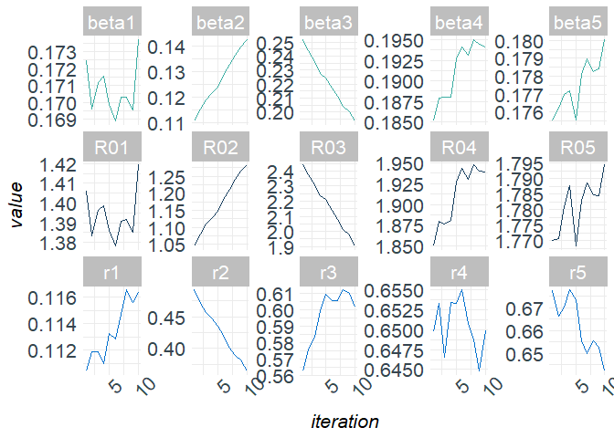
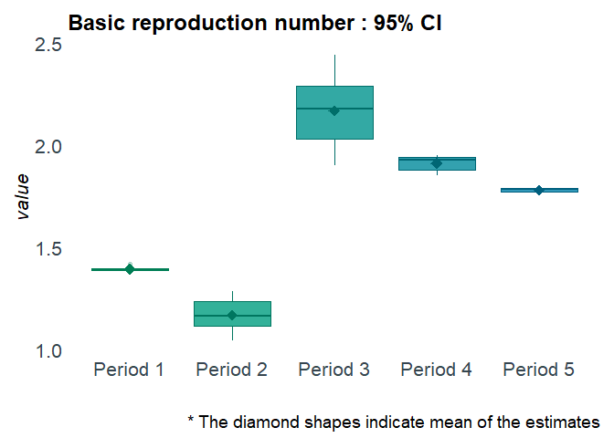

<!-- README.md is generated from README.Rmd. Please edit that file -->

# R package `SEIRfansy`

# Extended Susceptible-Exposed-Infected-Recovery Model

[](https://github.com/umich-biostatistics/SIERfansy)
[](https://github.com/umich-biostatistics/SEIRfansy)
[](https://doi.org/https://doi.org/10.1101/2020.09.24.20200238)

## Overview

This `R` package fits Extended Susceptible-Exposed-Infected-Recovery
(SEIR) Models for handling high false negative rate and symptom based
administration of diagnostic tests.

## Installation

If the devtools package is not yet installed, install it first:

``` r
install.packages('devtools')
```

``` r
# install SEIRfansy from Github:
devtools::install_github('umich-biostatistics/SEIRfansy') 
```

Once installed, load the package:

``` r
library(SEIRfansy)
#> Registered S3 methods overwritten by 'car':
#>   method                          from
#>   influence.merMod                lme4
#>   cooks.distance.influence.merMod lme4
#>   dfbeta.influence.merMod         lme4
#>   dfbetas.influence.merMod        lme4
```

## Example Usage

For this example, we use the built-in package data set `covid19`, which
contains dailies and totals of cases, recoveries, and deaths from the
COVID-19 outbreak in India from January 30 to September 21 of 2020.

### Setup

You will need the `dplyr` package for this example.

``` r
library(dplyr)
#> 
#> Attaching package: 'dplyr'
#> The following objects are masked from 'package:stats':
#> 
#>     filter, lag
#> The following objects are masked from 'package:base':
#> 
#>     intersect, setdiff, setequal, union
```

Training data set:

For training data, we use cases from April 1 to June 30

``` r
train = covid19[which(covid19$Date == "01 April "):which(covid19$Date == "30 June "),]
```

Testing data set:

For testing data, we use cases from July 1 to July 31

``` r
test = covid19[which(covid19$Date == "01 July "):which(covid19$Date == "31 July "),]
```

Data format for multinomial and Poisson distribution:

``` r
train_multinom = 
  train %>% 
  rename(Confirmed = Daily.Confirmed, 
         Recovered = Daily.Recovered,
         Deceased = Daily.Deceased) %>%
  dplyr::select(Confirmed, Recovered, Deceased)

test_multinom = 
  test %>% 
  rename(Confirmed = Daily.Confirmed, 
         Recovered = Daily.Recovered,
         Deceased = Daily.Deceased) %>%
  dplyr::select(Confirmed, Recovered, Deceased)

train_pois = 
  train %>% 
  rename(Confirmed = Daily.Confirmed) %>%
  dplyr::select(Confirmed)
```

Initialize parameters:

``` r
N = 1341e6 # population size of India
data_initial = c(2059, 169, 58, 424, 9, 11)
pars_start = c(c(1,0.8,0.6,0.4,0.2), c(0.2,0.2,0.2,0.25,0.2))
phases = c(1,15,34,48,62)
```

## SEIRfansy()

If interest is in model estimation but not prediction, then use
`SEIRfansy()`. Otherwise, use `SEIRfansy.predict()` (see below).

``` r
?SEIRfansy
```

``` r
cov19est = SEIRfansy(data = train_multinom, init_pars = pars_start, 
                     data_init = data_initial, niter = 1e3, BurnIn = 1e2, 
                     model = "Multinomial", N = N, lambda = 1/(69.416 * 365), 
                     mu = 1/(69.416 * 365), period_start = phases, opt_num = 1, 
                     auto.initialize = TRUE, f = 0.15)
#> Finding MLE
#> 1 MLE run finished!
#>  
#> MLE estimates : 
#> beta = ( 0.18, 0.1, 0.25, 0.18, 0.18 )
#> r = ( 0.112, 0.531, 0.544, 0.65, 0.688 )
#>  
#> MCMC:
#> Iter 100  A = 0  :  0.1762 0.1084 0.2526 0.1827 0.1763 0.1143 0.5228 0.5583 
#> 0.6479 0.6664
#> Iter 200  A = 0  :  0.1712 0.1116 0.2523 0.1857 0.1766 0.1147 0.5017 0.5733 
#> 0.6433 0.6674
#> Iter 300  A = 0  :  0.1674 0.1151 0.2472 0.1851 0.1785 0.1141 0.4979 0.5782 
#> 0.6426 0.6589
#> Iter 400  A = 0  :  0.1638 0.1182 0.2448 0.1876 0.1783 0.1137 0.4833 0.5887 
#> 0.6518 0.655
#> Iter 500  A = 0  :  0.162 0.1214 0.2402 0.1912 0.1773 0.1128 0.4612 0.6008 
#> 0.6439 0.6563
#> Iter 600  A = 153552.3  :  0.162 0.1276 0.2305 0.1901 0.1783 0.1131 0.4438 
#> 0.6061 0.6402 0.6518
#> Iter 700  A = 61341.17  :  0.1611 0.1303 0.2249 0.1918 0.1778 0.1129 0.4457 
#> 0.6037 0.6338 0.6551
#> Iter 800  A = 0  :  0.1635 0.1341 0.2178 0.1922 0.1779 0.115 0.4244 0.5991 
#> 0.635 0.6535
#> Iter 900  A = 0  :  0.1626 0.1378 0.2123 0.1925 0.1784 0.1152 0.4039 0.595 
#> 0.635 0.6535
#> Iter 1000  A = 2729.031  :  0.1594 0.1433 0.2095 0.1909 0.1767 0.115 0.3885 
#> 0.6005 0.6387 0.6591
#> Iter 1100  A = 190.5194  :  0.1616 0.1462 0.2039 0.1888 0.1783 0.1146 0.3792 
#> 0.5934 0.648 0.6518
```

Inspect the results:

``` r
names(cov19est)
class(cov19est$mcmc_pars)
names(cov19est$plots)
```

Plot the results:

``` r
plot(cov19est, type = "trace")
```

<!-- -->

``` r
plot(cov19est, type = "boxplot")
```

<!-- -->

## SEIRfansy.predict()

If interest is in model estimation and prediction, then use
`SEIRfansy.predict()`, which first runs `SEIRfansy()` internally, and
then predicts.

``` r
?SEIRfansy.predict
```

``` r
cov19pred = SEIRfansy.predict(data = train_multinom, init_pars = pars_start, 
                              data_init = data_initial, T_predict = 60, niter = 1e3, 
                              BurnIn = 1e2, data_test = test_multinom, model = "Multinomial", 
                              N = N, lambda = 1/(69.416 * 365), mu = 1/(69.416 * 365), 
                              period_start = phases, opt_num = 1, 
                              auto.initialize = TRUE, f = 0.15)
#> Estimating ... 
#>   
#> Finding MLE
#> 1 MLE run finished!
#>  
#> MLE estimates : 
#> beta = ( 0.18, 0.1, 0.25, 0.18, 0.18 )
#> r = ( 0.112, 0.531, 0.544, 0.65, 0.688 )
#>  
#> MCMC:
#> Iter 100  A = 9.044408e+13  :  0.1749 0.1101 0.2513 0.18 0.1762 0.1141 0.5142 
#> 0.5593 0.6535 0.6838
#> Iter 200  A = 10691.83  :  0.1706 0.1143 0.2489 0.1836 0.1756 0.1127 0.4827 
#> 0.5721 0.6513 0.6795
#> Iter 300  A = 0  :  0.1706 0.1167 0.242 0.1876 0.1753 0.1126 0.468 0.5806 
#> 0.6406 0.6736
#> Iter 400  A = 94771.11  :  0.171 0.1217 0.234 0.1886 0.1746 0.1124 0.4553 
#> 0.5791 0.6334 0.6728
#> Iter 500  A = 4.481127e+12  :  0.1725 0.1258 0.228 0.1864 0.1765 0.1112 0.4316 
#> 0.5909 0.6342 0.6632
#> Iter 600  A = 1.1715  :  0.1737 0.1294 0.2175 0.187 0.1761 0.1125 0.4054 0.5938 
#> 0.651 0.6672
#> Iter 700  A = 0.3504  :  0.1733 0.1349 0.2086 0.1898 0.1768 0.1156 0.3854 
#> 0.5858 0.6498 0.6686
#> Iter 800  A = 5e-04  :  0.1752 0.1396 0.1996 0.1903 0.1774 0.117 0.3729 0.5883 
#> 0.6453 0.6608
#> Iter 900  A = 28235745593  :  0.1778 0.1421 0.1934 0.1906 0.1782 0.1176 0.3531 
#> 0.5948 0.6448 0.6561
#> Iter 1000  A = 63.4289  :  0.1776 0.1456 0.1889 0.1916 0.1786 0.1156 0.3466 
#> 0.585 0.6469 0.6469
#> Iter 1100  A = 0  :  0.1791 0.1479 0.1843 0.1922 0.1792 0.1141 0.3336 0.5889 
#> 0.6514 0.6434
#>  
#> Predicting ...
```

Inspect the results:

``` r
names(cov19pred)
class(cov19pred$prediction)
class(cov19pred$mcmc_pars)
names(cov19pred$plots)
```

Plot the results:

``` r
plot(cov19pred, type = "trace")
```

<!-- -->

``` r
plot(cov19pred, type = "boxplot")
```

<!-- -->

``` r
plot(cov19pred, type = "panel")
```

<!-- -->

``` r
plot(cov19pred, type = "cases")
```

<!-- -->

### Current Suggested Citation

Ritwik Bhaduri, Ritoban Kundu, Soumik Purkayastha, Mike Kleinsasser,
Lauren J Beesley, Bhramar Mukherjee. “EXTENDING THE
SUSCEPTIBLE-EXPOSED-INFECTED-REMOVED(SEIR) MODEL TO HANDLE THE HIGH
FALSE NEGATIVE RATE AND SYMPTOM-BASED ADMINISTRATION OF COVID-19
DIAGNOSTIC TESTS: SEIR-fansy.” medRxiv 2020.09.24.20200238; doi:
<https://doi.org/10.1101/2020.09.24.20200238>
